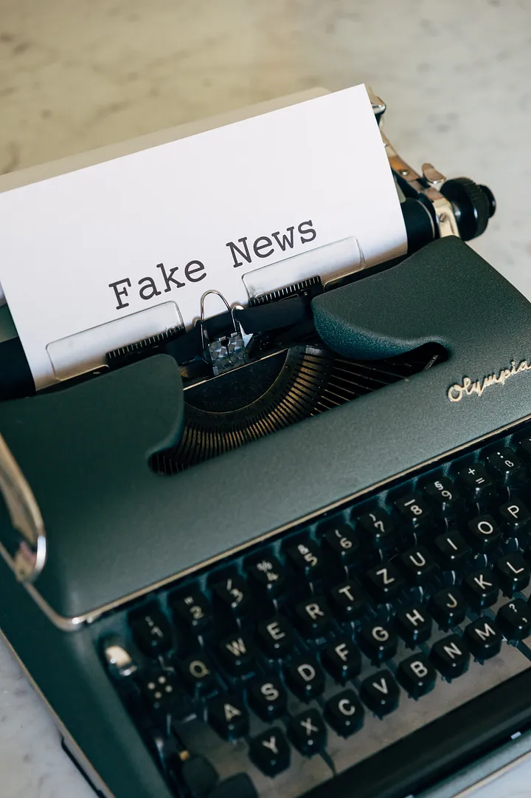

#  Usecase

## References

- [Predicting Fake News using NLP and Machine Learning | Scikit-Learn | GloVe | Keras | LSTM
A simple guide to applying traditional machine learning and deep learning techniques using Python on Kaggle’s Fake News Dataset. It also briefly includes text and stylometric analysis of the articles.](https://towardsdatascience.com/predicting-fake-news-using-nlp-and-machine-learning-scikit-learn-glove-keras-lstm-7bbd557c3443)

- [Fake News Detection using NLP techniques](https://medium.com/analytics-vidhya/fake-news-detection-using-nlp-techniques-c2dc4be05f99)

## Datasets

- [fake-and-real-news-dataset](https://www.kaggle.com/mrisdal/fake-and-real-news-dataset)   